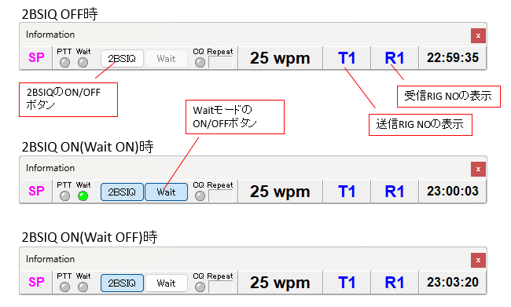

## 概要

シングルオペ2Radio(SO2R)とは、シングルオペであることは変わりないのですが、１人で２台の送信機を使いM/Sの様な運用を行う形態です。  
基本はシングルオペですから２波同時送信以外の制限はありません。バンドが違っていても同時送信はできません。  
JARL主催の国内コンテストでは”電信(電話)シングルオペ・オールバンド”と言う部門が該当します。　　

※このページはzLogバージョン2.9の説明です。  

## zLogでのSO2Rサポート(2.9.0.0～)

この機能はPHONE,CW両方で動作します。  

### メインウインドウ
下図のように、コール入力欄を左右に配置したレイアウトです。左はRIG-A、右はRIG-Bです。下段がRIG-Cです。  
RIG-A/RIG-Bはリグコントロール対応で、RIG-Cはリグコントロール非対応です。RIG-CはRIG-A/RIG-B以外の何かと言う使い方になります。（従来のVirtual Rigと同じイメージ）  
実際のRIGの配置も左側にRIG-A、右側にRIG-Bを配置して下さい。そうすることでzLogの画面と視覚的なイメージが一致します。  

V2.9からの新機能でRIG-A/RIG-Bは仮想のRIGとなり、複数のRIGを割り当てる事ができます。

受信用に選択しているRIGは青枠表示、送信用に選択しているRIGは緑色のランプが点灯します。送信はSHIFT+V，受信はSHIFT+Cで独立してRIG-A/RIG-Bを切り替えることができます。  

### 設定

SO2Rの設定については、配布している「ZLOG 令和EDITION V2.9 リグコントロール設定.pdf」を参照して下さい。  

### 2BSIQモード

SO2Rには３つの動作モードがあります。  
1. 2BSIQ OFFモード
2. 2BSIQ ON(Wait ON)モード
3. 2BSIQ ON(wait OFF)モード

#### 2BSIQ OFFモード

通常のモードです。送信RIG，受信RIGはオペレーターの操作で切り替えます。  
主にRIG-AでCQ、RIG-BでS&Pとして使います。  

#### 2BSIQ ON(Wait ON)モード

2BSIQモードとは、CQの際に受信RIGの逆側RIGでCQを送信する機能です。  
CQリピート時はRIG-AとRIG-Bで送受信を交互に入れ替えます。  
TABキーや↓キーを押下した場合、今送信中のメッセージの送信が終わってから次のメッセージを送信します。  
これは下記の様な使い方になります。  

1. RIG-AでSHIFT+Zを押し、CQを開始
1. RIG-BでCQ、RIG-Aでコール待ち
2. RIG-AとRIG-Bの送受を入れ替え
1. RIG-AでCQ、RIG-Bでコール待ち
1. RIG-Bでピックアップできれば交信
1. RIG-Bでピックアップできない場合、送受を入れ替えてRIG-Aでコール待ち、RIG-BでCQへ

#### 2BSIQ ON(Wait OFF)モード

基本の動きはWait ON時と同じですが、TABキーや↓キーを押下した場合、今送信中のメッセージを中止して直ちに次のメッセージを送信します。  

### RIG3とペアになるRIGの選択

2BSIQモードでペアとなるRIGを選択できます。  

1. RIG-CがOFFの場合、RIG-AとRIG-Bがペアとなります。
1. RIG-CがONの場合、"RIG-CとペアとなるRIGの選択"チェックボックスでRIG-A/RIG-Bを選択できます。
1. 機能#150(SHIFT+D)のショートカットキーで順にトグルします。  

| RIG-A | RIG-B | 動き |
| --- | --- | --- |
| OFF | OFF | RIG-Cのみ |
| ON  | OFF | RIG-Aとペア |
| OFF | ON  | RIG-Bとペア |
| ON  | ON  | RIG-A/RIG-B両方とペア（RIG-A～RIG-Cを順に回る）|

## システム構成例

zLogでのシステム構成例です。  
いずれもRIGが２セット、PC(zLog)が１セット必要です。    

### 自作の切り替え器を使うケース

図ではCWのみですが、実際はAudio系(MIC/Headphone)の切り替え機能も必要です。  

### WinKeyerやSO2R Neo等の2RIGに対応した機器を使うケース

CWのみの場合は、WinKeyerでも可能ですが、Phoneも含めたSO2Rの場合はSO2R Neo等の専用の機器をします。  
（WinKeyerはAudio系(MIC/Headphone)の機能はありません）  

## SO2R運用をサポートする機器

### リグ切り替え信号

現在選択中の送信RIG／受信RIGを表す信号をCOMポートに出力できます。  

#### TX

|選択RIG|DTR|RTS|
| --- | --- | --- |
|RIG-A|OFF|OFF|
|RIG-B|ON|OFF|
|RIG-C|OFF|ON|

#### RX

|選択RIG|RIG番号|DTR|RTS|
| --- | --- | --- | --- |
|RIG-A|1,3|OFF|-|
||2,4|ON|-|
|RIG-B|1,3|-|OFF|
||2,4|-|ON|
|RIG-C|RIG-Aが1,3|OFF|ON|
||RIG-Aが2,4|ON|ON|

### SO2R Neo
JH5GHM OMが頒布するSO2R用インターフェースBOXです。  
リグ／MIC,Headphone／CWの切り替えの他、送信時にどのRIGの受信音をHeadphoneに流すかなどを制御できます。  

