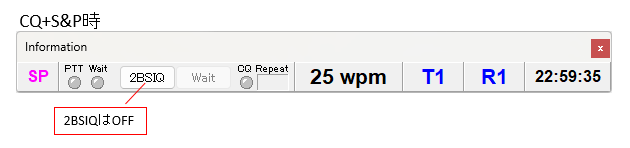

## SO2Rについて

SO2R(Single Op 2 Radio)とは、1人で2台のRIGを同時に使い、効率よくQSOを行う運用スタイルです。  
シングルオペですので、送信はいずれかの無線機だけの1波という制限を守りながら、2つの周波数を聞いたり、交互に送信したりします。  

※基本はシングルオペですから２波同時送信以外の制限はありません。バンドが違っていても同時送信はできません。JARL主催の国内コンテストでは”電信(電話)シングルオペ・オールバンド”と言う部門が該当します。  

## SO2Rの運用パターン

SO2Rにはいくつかの運用パターンがあります。  

1. CQ+S&P
1台のRIGでCQを出しながら、もう1台のRIGで未交信の局を探してQSOします(S&P=Serch&Pouce)。これがSO2Rの基本になります。  

1. CQ+CQ(交互CQ)
2台のRIGで交互にCQを出し、呼ばれた方でQSOします。
呼ばれていない方は、CQを止めます。

1. CQ+CQ(2BSIQ)
2台のRIGで交互にCQを出し、呼ばれた方でQSOします。  
呼ばれていない方のCQを止めず、QSOしている合間の受信している時にCQを送信します。  
両方のRIGで呼ばれたら、2つのQSOを同時進行させます。  

1. S&P+S&P
両方のRIGで未交信の局を探します。BAND MAPに出た未交信の局をクリックして取込むことを複合して行います。

## 必要な準備

1. リグコントロールされた2台以上のRIG。
2. zLogのハードウェア設定の運用スタイルを2Radioにして、切替信号の出力ポートなどの設定を済ませます。
3. zLogのPTT、Keying、ボイスメモリの出力を、zLogのRIG-A(左側RIG)、RIG-B(右側RIG)の切替に連動して、切り替える切替BOXを用意します。
4. 複数のRIGのヘッドフォン出力を、ヘッドフォンの左右に適切に接続する切替BOX(両耳RIG-A、両耳RIG-B、左耳RIG-A＋右耳RIG-B)

zLogの設定で切替用の信号が出せますので、その信号でリレーを切り替えるBOXを作ることになります。  

## 基本的な運用方法

### CQ+S&P（RIG-AでCQを出して、RIG-BでS&Pをする場合）

1. Informationウィンドウの2BSIQをOFFにします。
   
1. RIG-AでShift+ZでCQを出して、Shift+Cで受信RIGをRIG-Bに移します。
1. 未交信局を見つけたら、RIG-AがCQを送信していても、Fキー(自分のコール)を押すとRIG-Aの送信が止まり、RIG-BでFキー内容が送信されます。
1. Fキー内容の送信が終わると、送信RIGは自動的にRIG-Aに戻っていますので、Fキー(自分のNR)を押してQSOを確定させたら、Shift+Zを押してCQ再開です。
1. Shift+Cで受信RIGをRIG-Bに移していた時に、RIG-Aで呼ばれたら、ESCでCQを止めると受信RIGが自動的にRIG-Aに変わります。

### CQ+CQ（交互CQ）

1. 交互CQ用のメッセージを作成し、ハードウェア設定の自動リグ切替オプションで指定しておきます。
2. Informationウィンドウの2BSIQをON、WAITはOFFにします。
   
3. Shift+ZでRIG-A、RIG-B交互にCQが始まります。
4. どちらかで呼ばれたら、ESCを押してCQを止めてQSOします。

### CQ+CQ(2BSIQ)

1. 交互CQ用のメッセージを作成し、ハードウェア設定の自動リグ切替オプションで指定しておきます。
2. Informationウィンドウの2BSIQをON、WAITはONにします。
   
3. Shift+ZでRIG-A、RIG-B交互にCQが始まります。
4. 呼ばれたら普通にQSOを行います。こちらの送信は、反対側の送信が終わっていないと始まりませんので、タイミングが微妙にワンテンポ遅れる感じになる時がありますが、気にしないことです。hi
5. RIG-AでQSO中にRIG-Bでも呼ばれることがあります。慌てずに、聞こえたものを打ち込み、TABと;を押して、2つのQSOを同時に進めます。
6. この運用を可能にするためには、ヘッドフォンが自動的に左右に切替わっていることが必要です。
7. サイドトーンは聞きませんので、自分が今何を送信しているのか不安になることもありますので、CWモニターウィンドウを出しておくと安心です。  

2BSIQ運用中に、BAND MAPをクリックすると、受信中のRIG側にSPOT情報が取り込まれ、反対側のRIGのみのCQに自動的に切り替わります。  
S&P QSO後、Shift+JでCQを出していた周波数に戻ると、自動的に2BSIQに切替わり交互CQが再開されます。  
 
※このページはzLogバージョン2.9の説明です。  

## zLogでのSO2Rサポート(2.9.0.0～)

この機能はPHONE,CW両方で動作します。  

### メインウインドウ
下図のように、コール入力欄を左右に配置したレイアウトです。左はRIG-A、右はRIG-Bです。下段がRIG-Cです。  
RIG-A/RIG-Bはリグコントロール対応で、RIG-Cはリグコントロール非対応です。RIG-CはRIG-A/RIG-B以外の何かと言う使い方になります。（従来のVirtual Rigと同じイメージ）  
実際のRIGの配置も左側にRIG-A、右側にRIG-Bを配置して下さい。そうすることでzLogの画面と視覚的なイメージが一致します。  

V2.9からの新機能でRIG-A/RIG-Bは仮想のRIGとなり、複数のRIGを割り当てる事ができます。

受信用に選択しているRIGは青枠表示、送信用に選択しているRIGは緑色のランプが点灯します。送信はSHIFT+V，受信はSHIFT+Cで独立してRIG-A/RIG-Bを切り替えることができます。  

### 設定

SO2Rの設定については、配布している「ZLOG 令和EDITION V2.9 リグコントロール設定.pdf」を参照して下さい。  

### RIG3とペアになるRIGの選択

2BSIQモードでペアとなるRIGを選択できます。  

1. RIG-CがOFFの場合、RIG-AとRIG-Bがペアとなります。
1. RIG-CがONの場合、"RIG-CとペアとなるRIGの選択"チェックボックスでRIG-A/RIG-Bを選択できます。
1. 機能#150(SHIFT+D)のショートカットキーで順にトグルします。  

| RIG-A | RIG-B | 動き |
| --- | --- | --- |
| OFF | OFF | RIG-Cのみ |
| ON  | OFF | RIG-Aとペア |
| OFF | ON  | RIG-Bとペア |
| ON  | ON  | RIG-A/RIG-B両方とペア（RIG-A～RIG-Cを順に回る）|

## システム構成例

zLogでのシステム構成例です。  
いずれもRIGが２セット、PC(zLog)が１セット必要です。    

### 自作の切り替え器を使うケース

図ではCWのみですが、実際はAudio系(MIC/Headphone)の切り替え機能も必要です。  

### WinKeyerやSO2R Neo等の2RIGに対応した機器を使うケース

CWのみの場合は、WinKeyerでも可能ですが、Phoneも含めたSO2Rの場合はSO2R Neo等の専用の機器をします。  
（WinKeyerはAudio系(MIC/Headphone)の機能はありません）  

## SO2R運用をサポートする機器

### リグ切り替え信号

現在選択中の送信RIG／受信RIGを表す信号をCOMポートに出力できます。  

#### TX

|選択RIG|DTR|RTS|
| --- | --- | --- |
|RIG-A|OFF|OFF|
|RIG-B|ON|OFF|
|RIG-C|OFF|ON|

#### RX

|選択RIG|RIG番号|DTR|RTS|
| --- | --- | --- | --- |
|RIG-A|1,3|OFF|-|
||2,4|ON|-|
|RIG-B|1,3|-|OFF|
||2,4|-|ON|
|RIG-C|RIG-Aが1,3|OFF|ON|
||RIG-Aが2,4|ON|ON|

### SO2R Neo
JH5GHM OMが頒布するSO2R用インターフェースBOXです。  
リグ／MIC,Headphone／CWの切り替えの他、送信時にどのRIGの受信音をHeadphoneに流すかなどを制御できます。  

